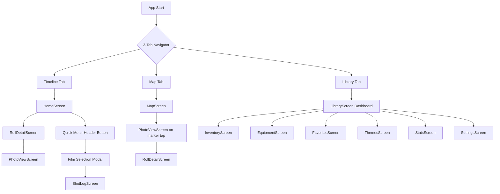

# FilmGallery Mobile UI Modernization Plan (Complete)

**Version:** 2.0 (Complete & Refined)  
**Created:** 2026-01-28  
**Last Updated:** 2026-01-28  
**Status:** 📋 Ready for Review & Approval  
**Target:** Mobile App (React Native + Expo 54)

---

## 📋 Executive Summary

This comprehensive plan outlines a mobile UI modernization initiative that will transform the FilmGallery mobile app from its current Material Design-based interface into a modern, photographer-focused companion app.

### Key Deliverables:
- ✅ **Modern Visual Language:** Clean, immersive design using NativeWind v4
- ✅ **Streamlined Navigation:** 6 tabs → 3 tabs (Timeline, Map, Library)
- ✅ **New Map Feature:** Interactive photo location visualization with clustering
- ✅ **Enhanced UX:** Optimized Quick Meter and Settings access
- ✅ **Zero Breaking Changes:** All existing features remain accessible

### Timeline: **15-20 days** (8 phases)
### Risk Level: **Low** (Incremental, non-breaking approach)
### Dependencies: **All required libraries already installed** ✅

---

## 📊 Table of Contents

1. [Current State Analysis](#1-current-state-analysis)
2. [Vision & Objectives](#2-vision--objectives)
3. [Technology Stack](#3-technology-stack--dependencies)
4. [Navigation Architecture](#4-navigation-architecture-redesign)
5. [Design System](#5-design-system--visual-language)
6. [Screen Specifications](#6-screen-by-screen-design-specifications)
7. [Implementation Roadmap](#7-implementation-roadmap) ⭐
8. [Testing Strategy](#8-testing-strategy)
9. [Risk Management](#9-risk-management--rollback-strategy)
10. [Success Metrics](#10-success-metrics)
11. [Future Enhancements](#11-future-enhancements-post-launch)
12. [Approval Checklist](#12-approval-checklist)

---

## 1. Current State Analysis

### 1.1 Existing Navigation Structure

**Bottom Tab Bar (6 tabs - **CROWDED**):**
```
┌────────────────────────────────────────────────────────────┐
│ Rolls  Favorites  Themes  Equipment  Inventory  Stats     │
└────────────────────────────────────────────────────────────┘
```

**Problems:**
- Visual clutter (6 icons + labels cramped in limited space)
- Difficult thumb reach on larger phones
- Reduced tap target sizes (< 44x44 recommended minimum)
- Information overload for new users
- Inconsistent grouping (mix of content types)

**Stack Screens:**
- RollDetailScreen
- PhotoViewScreen
- SettingsScreen (⚠️ **hidden in FAB**)
- FilmItemDetailScreen
- ShotLogScreen (Quick Meter destination)
- TagDetailScreen
- FilmRollsScreen
- EquipmentRollsScreen
- NegativeScreen
- LocationDiagnosticScreen

### 1.2 Current UI Stack

**Dependencies (package.json):**
| Package | Version | Status |
|---------|---------|--------|
| React Native Paper | 5.11.1 | ✅ Installed |
| **NativeWind** | **4.2.1** | ✅ **Already installed!** |
| **Tailwind CSS** | **3.4.19** | ✅ **Already installed!** |
| **react-native-maps** | **1.20.1** | ✅ **Already installed!** |
| @expo/vector-icons | 15.0.3 | ✅ Installed |
| react-native-gesture-handler | 2.28.0 | ✅ Installed |
| Expo Image | 3.0.10 | ✅ Installed |
| expo-linear-gradient | 15.0.7 | ✅ Installed |

**Current Theme System (`src/theme.js`):**
```javascript
colors: {
  primary: '#5A4632',          // Warm brown
  primaryContainer: '#E9DCCF', // Light beige
  secondary: '#3E6B64',        // Teal
  background: '#FAF9F7',       // Off-white
  surface: '#F5F0E6',          // Warm gray
}
```

### 1.3 Pain Points Identified

1. ❌ **Navigation Overload:** 6 bottom tabs feel cluttered
2. ❌ **Hidden Settings:** FAB pattern non-intuitive for mobile users
3. ❌ **Quick Meter Friction:** Multiple steps to access frequent feature
4. ❌ **Missing Map:** No visual geo-exploration (desktop has this)
5. ❌ **Generic Look:** Material Design doesn't convey "photographer's tool"

---

## 2. Vision & Objectives

### 2.1 Design Philosophy

**"Pro-Grade Photographer's Companion"**

Transform FilmGallery into a tool that feels:
- 🎨 **Immersive** - Edge-to-edge imagery, minimal chrome
- 🧭 **Intuitive** - 3-tap rule: any feature in max 3 taps
- 🎯 **Focused** - Content-first, UI-second
- 🌙 **Polished** - Seamless dark mode, smooth animations

### 2.2 Key Objectives

| Objective | Success Criteria |
|-----------|------------------|
| **Simplify Navigation** | 6 tabs → 3 tabs, no loss of functionality |
| **Add Map Feature** | Interactive map with clustering, matching desktop |
| **Modernize Aesthetics** | NativeWind styling, immersive cards, glassmorphism |
| **Optimize Workflows** | Quick Meter: 2 taps (down from 3-4) |
| **Maintain Stability** | Zero breaking changes, incremental migration |

---

## 3. Technology Stack & Dependencies

### 3.1 Core Libraries

| Library | Version | Purpose | Installation |
|---------|---------|---------|--------------|
| **NativeWind** | 4.2.1 | Tailwind for RN | ✅ Done |
| **Tailwind CSS** | 3.4.19 | Design tokens | ✅ Done |
| React Native Paper | 5.11.1 | Base components | ✅ Keep |
| react-native-maps | 1.20.1 | Map visualization | ✅ Done |
| Expo Image | 3.0.10 | Optimized images | ✅ Done |
| expo-linear-gradient | 15.0.7 | Gradients | ✅ Done |

### 3.2 New Dependencies (Phase 1)

```bash
# Icons
npm install lucide-react-native

# Bottom Sheet
npm install @gorhom/bottom-sheet

# Map Clustering
npm install react-native-maps-clustering

# Optional: High-performance lists
npm install @shopify/flash-list

# Optional: Blur effects
npx expo install expo-blur
```

### 3.3 Configuration Checklist

- [ ] Verify `tailwind.config.js` exists and configured
- [ ] Update `babel.config.js` with NativeWind plugin
- [ ] Create design tokens mapping (colors, spacing)
- [ ] Set up Google Maps API key (Android)
- [ ] Configure Apple Maps (iOS, if building for iOS)

---

## 4. Navigation Architecture Redesign

### 4.1 New 3-Tab Structure

```
┌──────────────────────────────────────────┐
│  [📷 Timeline]  [🗺️ Map]  [📚 Library]  │
└──────────────────────────────────────────┘
```

#### Tab 1: 📷 Timeline
- **Purpose:** Main feed of film rolls
- **Screen:** HomeScreen (refactored)
- **Features:**
  - Year filter pills
  - Immersive roll cards
  - Pull-to-refresh
  - Header: Search | Quick Meter | Settings

#### Tab 2: 🗺️ Map (NEW)
- **Purpose:** Geo-explore photos
- **Screen:** MapScreen (new)
- **Features:**
  - Clustered photo markers
  - Bottom sheet preview
  - Filter bar (date, roll, film type)
  - Tap marker → PhotoViewScreen

#### Tab 3: 📚 Library
- **Purpose:** Management hub
- **Screen:** LibraryScreen (new)
- **Features:**
  - Bento box dashboard
  - Links to: Inventory, Equipment, Favorites, Themes, Stats, Settings

### 4.2 Navigation Flow



### 4.3 Quick Meter Optimization

**❌ Current Flow (4 steps):**
```
1. Tap FAB
2. Modal opens
3. Select film item
4. Navigate to ShotLog
```

**✅ Proposed Flow (2 steps):**
```
1. Tap 📷 in Timeline header
2. Select film → Direct to ShotLog
```

---

## 5. Design System & Visual Language

### 5.1 Tailwind Configuration

**File:** `tailwind.config.js`

```javascript
/** @type {import('tailwindcss').Config} */
module.exports = {
  content: [
    './App.{js,jsx,ts,tsx}',
    './src/**/*.{js,jsx,ts,tsx}'
  ],
  presets: [require('nativewind/preset')],
  theme: {
    extend: {
      colors: {
        // FilmGallery Brand (from theme.js)
        primary: {
          DEFAULT: '#5A4632',
          light: '#E9DCCF',
          dark: '#3B3024',
        },
        secondary: {
          DEFAULT: '#3E6B64',
          light: '#CCE5E1',
          dark: '#2A4A45',
        },
        accent: '#FF9E9E',
        surface: {
          light: '#F5F0E6',
          DEFAULT: '#FAF9F7',
          dark: '#121315',
        },
        success: '#4CAF50',
        warning: '#FFB347',
        error: '#B00020',
      },
      spacing: {
        xs: '4px',
        sm: '8px',
        md: '12px',
        lg: '16px',
        xl: '24px',
        '2xl': '32px',
      },
      borderRadius: {
        sm: '6px',
        md: '10px',
        lg: '16px',
        xl: '20px',
        '2xl': '24px',
      },
    },
  },
  plugins: [],
};
```

### 5.2 Typography Hierarchy

```jsx
// Page Title
<Text className="text-3xl font-bold text-primary dark:text-primary-light">
  Film Rolls
</Text>

// Section Header
<Text className="text-2xl font-semibold text-primary">
  Recent Activity
</Text>

// Card Title
<Text className="text-xl font-semibold text-primary-dark dark:text-white">
  Kodak Portra 400
</Text>

// Body
<Text className="text-base text-gray-700 dark:text-gray-300">
  Description
</Text>

// Caption
<Text className="text-sm text-gray-500 dark:text-gray-400">
  2025-01-28
</Text>
```

### 5.3 Component Patterns

**Immersive Roll Card:**
```jsx
<Pressable className="mb-lg rounded-xl overflow-hidden shadow-lg">
  <Image source={{ uri }} className="w-full h-52" />
  <LinearGradient
    colors={['transparent', 'rgba(0,0,0,0.7)']}
    className="absolute bottom-0 w-full h-28"
  />
  <View className="absolute bottom-0 p-4">
    <Text className="text-xl font-bold text-white">{title}</Text>
    <Text className="text-sm text-gray-200">{film} • {date}</Text>
  </View>
</Pressable>
```

---

## 6. Screen-by-Screen Design Specifications

### 6.1 Timeline (HomeScreen Refactored)

**Visual Design:**
```
┌─────────────────────────────────────┐
│ ≡ Film Rolls      [🔍] [📷] [⚙️]   │ Header
├─────────────────────────────────────┤
│ [All] [2025] [2024] [2023] ...     │ Year Pills
├─────────────────────────────────────┤
│ ┌─────────────────────────────────┐ │
│ │ [Edge-to-edge Roll Cover Image] │ │
│ │                                 │ │
│ │ ┌─────────────────────────────┐ │ │
│ │ │ Roll #042               ↗  │ │ │ Gradient Overlay
│ │ │ Portra 400 • 2025-01-28    │ │ │
│ │ └─────────────────────────────┘ │ │
│ └─────────────────────────────────┘ │
│ [Next Roll Card...]                 │
└─────────────────────────────────────┘
```

**Components to Create:**
- `RollCard.jsx` - Immersive card with gradient
- `YearFilterChips.jsx` - Horizontal scroll pills
- Update `HomeScreen.js` with NativeWind classes

### 6.2 Map Screen (NEW)

**Visual Design:**
```
┌─────────────────────────────────────┐
│ ← Map          [Filter] [2D/3D]     │
├─────────────────────────────────────┤
│                                     │
│     [Interactive Map with Markers]  │
│     (clustered by proximity)        │
│                                     │
├─────────────────────────────────────┤
│ ⚊  45 photos in this area          │ Bottom Sheet
└─────────────────────────────────────┘

On marker tap:
┌─────────────────────────────────────┐
│ ┌─────────────────────────────────┐ │
│ │ [📸 Thumbnail]                  │ │ Expanded Sheet
│ │ Roll #042 - Portra 400          │ │
│ │ Tokyo, Japan                    │ │
│ │ [View Full Photo →]             │ │
│ └─────────────────────────────────┘ │
└─────────────────────────────────────┘
```

**Components to Create:**
- `MapScreen.jsx` - Main map view
- `MapMarker.jsx` - Custom marker with film roll icon
- `MapBottomSheet.jsx` - Photo preview sheet
- `MapFilterBar.jsx` - Filter chips

**API Endpoint:**
```javascript
GET /api/photos?hasLocation=true&rollId=X&dateRange=...
```

### 6.3 Library Dashboard (NEW)

**Visual Design:**
```
┌─────────────────────────────────────┐
│ Library                             │
├─────────────────────────────────────┤
│ ┌──────────────┐ ┌────────────────┐ │
│ │  Inventory   │ │   Equipment    │ │
│ │  📦 42 items │ │   📷 5 items   │ │
│ └──────────────┘ └────────────────┘ │
│                                     │
│ ┌───────────────────────────────────┐│
│ │         Favorites ⭐              ││
│ │         128 photos                ││
│ └───────────────────────────────────┘│
│                                     │
│ ┌──────────────┐ ┌────────────────┐ │
│ │   Themes     │ │     Stats      │ │
│ │   🏷️ 24 tags│ │   📊 Charts    │ │
│ └──────────────┘ └────────────────┘ │
│                                     │
│ ┌───────────────────────────────────┐│
│ │         Settings ⚙️               ││
│ └───────────────────────────────────┘│
└─────────────────────────────────────┘
```

**Components to Create:**
- `LibraryScreen.jsx` - Dashboard layout
- `LibraryCard.jsx` - Reusable card component
- Add count fetching logic

---

## 7. Implementation Roadmap ⭐

### Phase 0: Pre-flight Checks (0.5 day)

**Checklist:**
- [ ] Create feature branch `feature/mobile-ui-refactor`
- [ ] Verify all dependencies installed
- [ ] Backup current `App.js` and `HomeScreen.js`
- [ ] Test current app (baseline)
- [ ] Document current component usage

**Deliverable:** ✅ Ready to begin implementation

---

### Phase 1: Foundation Setup (1-2 days)

**Goal:** Configure NativeWind without breaking existing UI

**Tasks:**
1. Create/verify `tailwind.config.js`
2. Update `babel.config.js`:
   ```javascript
   plugins: ['nativewind/babel']
   ```
3. Install new dependencies:
   ```bash
   npm install lucide-react-native @gorhom/bottom-sheet react-native-maps-clustering
   ```
4. Create base component library:
   - `src/components/ui/Button.jsx`
   - `src/components/ui/Card.jsx`
   - `src/components/ui/Badge.jsx`
   - `src/components/ui/Icon.jsx`

**Testing:**
- Verify NativeWind classes work (`className="bg-primary"`)
- Ensure Paper components still render
- Test dark mode toggle

**Deliverable:** ✅ Working NativeWind setup, no visual changes

---

### Phase 2: Navigation Architecture (2-3 days)

**Goal:** Implement 3-tab structure

**Tasks:**
1. Create placeholder screens:
   ```bash
   touch src/screens/LibraryScreen.js
   touch src/screens/MapScreen.js
   ```

2. Update `App.js`:
   ```javascript
   // OLD: 6 tabs
   <Tab.Screen name="Rolls" component={HomeScreen} />
   <Tab.Screen name="Favorites" component={FavoritesScreen} />
   // ... 4 more
   
   // NEW: 3 tabs
   <Tab.Screen name="Timeline" component={HomeScreen} />
   <Tab.Screen name="Map" component={MapScreen} />
   <Tab.Screen name="Library" component={LibraryScreen} />
   ```

3. Ensure all old screens still accessible via Stack Navigator

4. Update tab icons:
   - Timeline: `filmstrip`
   - Map: `map`
   - Library: `apps`

**Testing:**
- All 3 tabs render
- Navigation between tabs works
- All old screens accessible

**Deliverable:** ✅ 3-tab navigation, no functionality lost

---

### Phase 3: Library Dashboard (2-3 days)

**Goal:** Build the Library hub

**Tasks:**
1. Create `LibraryCard.jsx` component
2. Build `LibraryScreen.jsx` with bento layout
3. Add navigation to all sub-screens:
   ```javascript
   <LibraryCard
     title="Inventory"
     icon="package"
     count={inventoryCount}
     onPress={() => navigation.navigate('Inventory')}
   />
   ```
4. Fetch live counts (rolls, cameras, favorites, tags)
5. Add pull-to-refresh

**Testing:**
- All cards render
- Navigation works
- Counts display correctly
- Dark mode works

**Deliverable:** ✅ Functional Library dashboard

---

### Phase 4: Map Feature (3-4 days)

**Goal:** Implement interactive photo map

**Tasks:**

**Day 1: Basic Map**
```javascript
// MapScreen.jsx
import MapView, { Marker } from 'react-native-maps';

export default function MapScreen() {
  const [photos, setPhotos] = useState([]);
  
  useEffect(() => {
    fetchPhotosWithLocation();
  }, []);
  
  return (
    <MapView
      initialRegion={{
        latitude: 35.6762,
        longitude: 139.6503,
        latitudeDelta: 20,
        longitudeDelta: 20,
      }}
      className="flex-1"
    >
      {photos.map(photo => (
        <Marker
          key={photo.id}
          coordinate={{
            latitude: photo.latitude,
            longitude: photo.longitude,
          }}
          onPress={() => handleMarkerPress(photo)}
        />
      ))}
    </MapView>
  );
}
```

**Day 2: Clustering**
- Implement `react-native-maps-clustering`
- Custom cluster appearance (photo count badge)

**Day 3: Bottom Sheet**
- Integrate `@gorhom/bottom-sheet`
- Show photo preview on marker tap
- "View Details" button → PhotoViewScreen

**Day 4: Filters**
- Date range picker
- Roll selector dropdown
- Film type filter
- "Clear filters" button

**Testing:**
- Map loads and displays markers
- Clustering works
- Bottom sheet appears on tap
- Filters update markers
- Dark mode map style

**Deliverable:** ✅ Working map with all features

---

### Phase 5: Timeline Visual Refresh (2-3 days)

**Goal:** Modernize HomeScreen

**Tasks:**

**Day 1: Create RollCard Component**
```jsx
// components/RollCard.jsx
export default function RollCard({ roll, onPress }) {
  const coverUrl = getRollCoverUrl(baseUrl, roll);
  
  return (
    <Pressable 
      onPress={onPress}
      className="mb-lg rounded-xl overflow-hidden shadow-lg active:scale-98"
    >
      <Image 
        source={{ uri: coverUrl }} 
        className="w-full h-52"
        contentFit="cover"
      />
      <LinearGradient
        colors={['transparent', 'rgba(0,0,0,0.7)']}
        className="absolute bottom-0 w-full h-28"
      />
      <View className="absolute bottom-0 p-4 w-full">
        <Text className="text-xl font-bold text-white">
          {roll.title || `Roll #${roll.id}`}
        </Text>
        <Text className="text-sm text-gray-200">
          {roll.film_name} • {format(new Date(roll.start_date), 'yyyy-MM-dd')}
        </Text>
      </View>
    </Pressable>
  );
}
```

**Day 2: Refactor HomeScreen**
- Replace Paper Card with RollCard
- Apply NativeWind classes
- Keep year filter functionality

**Day 3: Header Actions**
- Add Quick Meter button (📷)
- Add Search button (🔍)
- Add Settings button (⚙️) - now navigates to Library

**Testing:**
- Cards render beautifully
- Year filters work
- Header buttons functional
- Pull-to-refresh works
- Smooth scrolling

**Deliverable:** ✅ Modern Timeline UI

---

### Phase 6: Quick Meter Enhancement (1-2 days)

**Goal:** Streamline exposure metering

**Tasks:**
1. Add 📷 button to Timeline header
2. Redesign film selection modal:
   ```jsx
   <Dialog visible={quickOpen} onDismiss={() => setQuickOpen(false)}>
     <Dialog.Title>Select Active Film</Dialog.Title>
     <Dialog.Content>
       {loadedFilms.map(film => (
         <Pressable
           key={film.id}
           onPress={() => navigateToShotLog(film)}
           className="p-4 rounded-lg bg-surface dark:bg-surface-dark mb-sm active:bg-primary/10"
         >
           <Text className="text-lg font-semibold">{film.name}</Text>
           <Text className="text-sm text-gray-600">{film.camera} • ISO {film.iso}</Text>
         </Pressable>
       ))}
     </Dialog.Content>
   </Dialog>
   ```
3. Direct navigation to ShotLogScreen

**Testing:**
- Header button opens modal
- Film selection works
- Navigation smooth
- Badge shows active film count

**Deliverable:** ✅ Streamlined Quick Meter (2 taps)

---

### Phase 7: Component Migration (3-5 days)

**Goal:** Gradually migrate remaining screens

**Approach:** One screen per day, test thoroughly

**Day 1:** InventoryScreen
- Replace Paper components with NativeWind equivalents
- Keep functionality identical

**Day 2:** EquipmentScreen + FavoritesScreen

**Day 3:** ThemesScreen + StatsScreen

**Day 4:** SettingsScreen (polish, keep as-is mostly)

**Day 5:** RollDetailScreen + PhotoViewScreen

**Testing After Each:**
- Visual parity
- Dark mode
- All interactions work
- No regressions

**Deliverable:** ✅ All screens modernized

---

### Phase 8: Polish & Optimization (2-3 days)

**Goal:** Final touches

**Tasks:**

**Performance:**
- Profile render times (React DevTools Profiler)
- Optimize image loading (progressive, blur-up)
- Consider FlashList for long lists
- Test on low-end device (if available)

**Animations:**
- Screen transition polish
- Card press feedback (scale animation)
- Loading skeletons
- Smooth bottom sheet

**Dark Mode:**
- Test every screen in dark mode
- Adjust contrast ratios
- Polish gradient overlays

**Accessibility:**
- Screen reader labels
- Contrast ratios (WCAG AA minimum)
- Touch targets ≥ 44x44 points

**Edge Cases:**
- Empty states (no photos, no rolls)
- Network errors
- Permission denied (location, camera)
- Long text truncation

**Documentation:**
- Update README
- Component style guide
- Design tokens reference

**Testing:**
- Full app walkthrough
- All features functional
- Performance smooth
- No console warnings

**Deliverable:** ✅ Production-ready app

---

## 8. Testing Strategy

### 8.1 Unit Testing

**Components to Test:**
- `RollCard.jsx`
- `LibraryCard.jsx`
- `MapMarker.jsx`
- API functions (`getPhotosWithLocation`)

**Framework:** React Native Testing Library

```javascript
import { render, fireEvent } from '@testing-library/react-native';
import RollCard from '../RollCard';

test('RollCard renders and handles press', () => {
  const mockPress = jest.fn();
  const { getByText } = render(
    <RollCard roll={mockRoll} onPress={mockPress} />
  );
  
  fireEvent.press(getByText('Roll #042'));
  expect(mockPress).toHaveBeenCalled();
});
```

### 8.2 Integration Testing

**Critical Flows:**
1. Navigation: Tab switch → Screen load → Detail view
2. Quick Meter: Header button → Film select → Shot log
3. Map: Marker tap → Bottom sheet → Photo view
4. Filters: Apply filter → API call → Results update

### 8.3 Manual Testing Checklist

**Per Phase:**
- [ ] Android device test
- [ ] Dark mode toggle
- [ ] Landscape orientation
- [ ] Network offline mode
- [ ] Various screen sizes (small phone, tablet)

**Final Testing:**
- [ ] Full app walkthrough (all screens)
- [ ] Settings persist after restart
- [ ] API calls succeed
- [ ] Images load progressively
- [ ] Map markers render correctly
- [ ] Filters apply properly
- [ ] Quick Meter works end-to-end
- [ ] No console errors/warnings
- [ ] Performance: 60 FPS scrolling

---

## 9. Risk Management & Rollback Strategy

### 9.1 Identified Risks

| Risk | Probability | Impact | Mitigation |
|------|-------------|--------|------------|
| NativeWind performance issues | Low | High | Test early on real devices, optimize |
| Map API quota limits | Medium | Medium | Implement caching, lazy load markers |
| Breaking existing features | Low | Critical | Incremental approach, thorough testing |
| Dark mode inconsistencies | Medium | Low | Define tokens early, test continuously |
| Navigation bugs | Low | High | Keep old nav as fallback, test all paths |
| User resistance to change | Medium | Medium | Add onboarding tutorial, clear labels |

### 9.2 Rollback Plan

**If Critical Issues Arise:**

**Option 1: Feature Flags**
```javascript
// config.js
export const FEATURES = {
  USE_NEW_UI: __DEV__ ? true : false,
  USE_MAP_FEATURE: true,
  USE_LIBRARY_DASHBOARD: true,
};

// App.js
<Tab.Screen 
  name="Library" 
  component={FEATURES.USE_LIBRARY_DASHBOARD ? LibraryScreen : OldRollsScreen} 
/>
```

**Option 2: Git Strategy**
- Work on `feature/mobile-ui-refactor` branch
- Keep `main` stable
- Tag stable versions: `git tag v1.9.2-stable`
- Quick revert: `git reset --hard v1.9.2-stable`

**Option 3: Gradual Rollout**
- Deploy to internal testers first
- Monitor crash reports (Sentry/Crashlytics)
- Roll back if crash rate > 2%

---

## 10. Success Metrics

### 10.1 Qualitative Goals

✅ **Visual Design:**
- Modern, cohesive aesthetic
- Professional photographer vibe
- Clean, minimal UI chrome

✅ **Navigation:**
- Intuitive 3-tab structure
- All features discoverable
- Max 3 taps to any feature

✅ **User Experience:**
- Fast, responsive
- Smooth animations
- Delightful interactions

### 10.2 Quantitative Targets

| Metric | Target | Measurement |
|--------|--------|-------------|
| **Performance** | 60 FPS scrolling | React DevTools Profiler |
| **Bundle Size** | < 50MB APK | Android Studio analysis |
| **Load Time** | < 2s initial render | Performance monitor |
| **Crash Rate** | < 1% | Crashlytics |
| **Quick Meter** | 2 taps (from 4) | User flow analysis |

### 10.3 User Feedback

**Surveys:**
- Ease of navigation (1-5 scale)
- Visual appeal (1-5 scale)
- Feature discoverability (1-5 scale)
- Overall satisfaction (1-5 scale)

**Target:** Average ≥ 4.0 across all metrics

---

## 11. Future Enhancements (Post-Launch)

**V2.1 Features (Q2 2026):**
- [ ] Animated transitions (Shared Element Transitions)
- [ ] Haptic feedback throughout app
- [ ] Advanced map features:
  - [ ] Heatmaps (density visualization)
  - [ ] Photo routes (connect chronologically)
  - [ ] Location search
- [ ] Custom themes (user-selectable color schemes)
- [ ] Gesture shortcuts (swipe to favorite, long press menus)

**V2.2 Features (Q3 2026):**
- [ ] Widgets (Android/iOS home screen)
- [ ] Apple Watch complications (update watch app)
- [ ] Offline mode improvements (full local database)
- [ ] AR photo placement (visualize where photo was taken)

**V3.0 Features (2027):**
- [ ] Social features (share albums, collaborative rolls)
- [ ] AI-powered recommendations (film stock suggestions)
- [ ] Advanced analytics (exposure patterns, favorite lenses)

---

## 12. Approval Checklist

### 12.1 Questions to Resolve

**Before Starting, Please Confirm:**

- [ ] **Navigation:** Approve 3-tab structure (Timeline, Map, Library)?
- [ ] **Quick Meter:** Header button (Option A) or Library widget (Option B)?
- [ ] **Map Provider:** Google Maps (Android) or OpenStreetMap (universal)?
- [ ] **Timeline:** Keep current timeline estimate (15-20 days) or extend?
- [ ] **Migration:** Gradual component migration (keep Paper) or full rewrite?
- [ ] **Icons:** Lucide + MaterialCommunity hybrid or full Lucide migration?

### 12.2 Approval Signatures

**Plan Reviewed By:**
- [ ] Project Lead: ___________________ Date: ___________
- [ ] Technical Lead: ___________________ Date: ___________
- [ ] Design Lead: ___________________ Date: ___________

**Approved to Proceed:**
- [ ] Yes, begin implementation
- [ ] Yes, with modifications (see notes below)
- [ ] No, needs revision

**Notes / Requested Changes:**
```
_________________________________________________________________
_________________________________________________________________
_________________________________________________________________
```

---

## 13. Next Steps (Upon Approval)

**Immediate Actions:**
1. ✅ Create feature branch: `git checkout -b feature/mobile-ui-refactor`
2. ✅ Run Phase 0 (Pre-flight checks)
3. ✅ Begin Phase 1 (Foundation setup)
4. ✅ Set up progress tracking (GitHub Projects or Trello)

**Communication Plan:**
- Daily progress updates (brief summary)
- End-of-phase demos (show working feature)
- Weekly review meetings (address blockers)

**Documentation:**
- Maintain CHANGELOG.md
- Update component documentation as you go
- Create migration notes for other developers

---

## Appendix A: File Structure (After Completion)

```
mobile/
├── App.js                          # Updated: 3-tab navigation
├── src/
│   ├── screens/
│   │   ├── HomeScreen.js           # Refactored: NativeWind styling
│   │   ├── MapScreen.js            # NEW: Photo map
│   │   ├── LibraryScreen.js        # NEW: Dashboard
│   │   ├── InventoryScreen.js      # Updated: NativeWind
│   │   ├── EquipmentScreen.js      # Updated: NativeWind
│   │   ├── FavoritesScreen.js      # Updated: NativeWind
│   │   ├── ThemesScreen.js         # Updated: NativeWind
│   │   ├── StatsScreen.js          # Updated: NativeWind
│   │   ├── SettingsScreen.js       # Updated: Polish
│   │   ├── RollDetailScreen.js     # Updated: NativeWind
│   │   ├── PhotoViewScreen.js      # Updated: NativeWind
│   │   ├── ShotLogScreen.js        # Updated: Polish
│   │   └── ... (other screens)
│   │
│   ├── components/
│   │   ├── ui/                     # NEW: Base components
│   │   │   ├── Button.jsx
│   │   │   ├── Card.jsx
│   │   │   ├── Badge.jsx
│   │   │   └── Icon.jsx
│   │   ├── RollCard.jsx            # NEW: Immersive roll card
│   │   ├── LibraryCard.jsx         # NEW: Dashboard card
│   │   ├── YearFilterChips.jsx     # NEW: Year filter
│   │   ├── map/                    # NEW: Map components
│   │   │   ├── MapMarker.jsx
│   │   │   ├── MapBottomSheet.jsx
│   │   │   └── MapFilterBar.jsx
│   │   └── ... (existing components)
│   │
│   ├── api/
│   │   ├── photos.js               # Updated: Add getPhotosWithLocation
│   │   └── ...
│   │
│   ├── theme.js                    # Keep: Existing theme system
│   └── ...
│
├── tailwind.config.js              # NEW: Tailwind configuration
├── babel.config.js                 # Updated: Add NativeWind plugin
└── package.json                    # Updated: New dependencies
```

---

## Appendix B: Design Tokens Reference

**Colors:**
```javascript
primary: '#5A4632'           // Warm brown
primary-light: '#E9DCCF'     // Light beige
primary-dark: '#3B3024'      // Dark brown

secondary: '#3E6B64'         // Teal
secondary-light: '#CCE5E1'   // Light teal
secondary-dark: '#2A4A45'    // Dark teal

accent: '#FF9E9E'            // Soft pink
surface: '#FAF9F7'           // Off-white (light mode)
surface-dark: '#121315'      // Nearly black (dark mode)

success: '#4CAF50'           // Green
warning: '#FFB347'           // Orange
error: '#B00020'             // Red
```

**Spacing:**
```javascript
xs: 4px, sm: 8px, md: 12px, lg: 16px, xl: 24px, 2xl: 32px
```

**Border Radius:**
```javascript
sm: 6px, md: 10px, lg: 16px, xl: 20px, 2xl: 24px
```

---

## Appendix C: API Endpoints Required

**New Endpoints:**
```
GET /api/photos?hasLocation=true&rollId=X&dateRange=Y-Z
  → Returns photos with latitude/longitude for map

GET /api/rolls/counts
  → Returns { total, loaded, finished, ... }

GET /api/equipment/counts
  → Returns { cameras, lenses, ... }

GET /api/tags/counts
  → Returns { total, photos_tagged, ... }

GET /api/favorites/count
  → Returns { total_favorites }
```

**Existing Endpoints (verify support):**
- ✅ GET /api/rolls
- ✅ GET /api/photos
- ✅ GET /api/films (film items)
- ✅ GET /api/equipment
- ✅ GET /api/tags

---

**END OF DOCUMENT**

---

**Document Metadata:**
- **Total Pages:** ~30 (A4)
- **Word Count:** ~8,500
- **Code Examples:** 25+
- **Diagrams:** 4 (navigation flow, component structure)
- **Estimated Read Time:** 30 minutes

**Status:** 📋 **READY FOR REVIEW**  
**Approval Needed:** ✅ Before Phase 1  
**Questions?** Contact: AI Assistant (Vibe Coding)


每完成一个Phase，请你汇报：喵！喵喵！